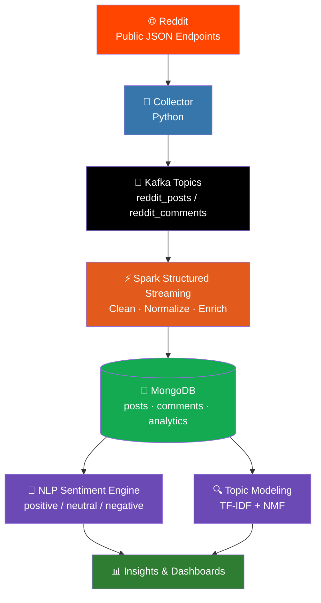

# 🚀 PulseStream - Real-Time Social Media Sentiment Intelligence

<p align="center">
  <em>A production-grade Big Data pipeline turning raw Reddit chatter into live sentiment and topic insights.</em>
</p>

<p align="center">
  
  
  
  
  
</p>

---

## 📌 Project Overview

PulseStream is a **fully containerized, end-to-end Big Data pipeline** built to capture the pulse of online conversation in real time. Using Reddit as the data source, the system listens, processes, understands, and explains what people are talking about - and how they feel about it - as it happens.

The pipeline covers the full lifecycle of a modern streaming data product:

- **Real-time ingestion** from live social data
- **Stream processing** at scale
- **Persistent, queryable storage**
- **NLP-driven sentiment classification**
- **Unsupervised topic extraction** for context and insight

Every service is orchestrated through **Docker Compose**, so the entire stack spins up identically on any machine - no manual setup, no dependency headaches, no "works on my machine."

---

## 🛠️ Tech Stack at a Glance

| Layer | Technology | Purpose |
|---|---|---|
| 📥 Ingestion | Python | Scrapes Reddit's public JSON endpoints |
| 📨 Messaging | Apache Kafka | Streams raw posts & comments in real time |
| ⚡ Processing | Apache Spark (Structured Streaming) | Cleans, normalizes & enriches data on the fly |
| 🍃 Storage | MongoDB | Persists raw + processed documents & analytics |
| 🧠 NLP | scikit-learn (TF-IDF, Bag-of-Words) | Sentiment classification |
| 🔍 Topic Modeling | scikit-learn (TF-IDF + NMF) | Unsupervised theme extraction |
| 🐳 Orchestration | Docker & Docker Compose | One-command, reproducible deployment |

---

## 🧠 Global Architecture



---

## 🧩 Team Contributions

### 👤 Mohamed Amine Azirgui — Data Ingestion & Streaming Backbone

**Responsibilities**
- Scraped Reddit using public JSON endpoints (no API keys required)
- Produced structured JSON messages into two Kafka topics: `reddit_posts` and `reddit_comments`
- Designed a Docker-first ingestion stack for reliable, repeatable deployment
- Implemented Kafka health checks to guarantee safe service startup order
- Persisted ingestion state to prevent duplicate data on restarts

**Technologies:** Python · Apache Kafka · Docker & Docker Compose

---

### 👤 Youssef Bouzit — Streaming ETL & Storage (Spark + MongoDB)

**Responsibilities**
- Implemented Spark Structured Streaming jobs to consume Kafka topics in real time
- Cleaned, normalized, and enriched raw text streams
- Persisted both raw and processed data into MongoDB
- Built time-based aggregations for downstream analytics
- Resolved Windows/Hadoop compatibility issues by running Spark inside Linux containers

**Technologies:** Apache Spark (Structured Streaming) · Apache Kafka · MongoDB · Docker

---

### 👤 Mouad Souhal — Sentiment Analysis & NLP Modeling

**Responsibilities**
- Built an automated NLP pipeline to classify posts and comments as **positive**, **neutral**, or **negative**
- Stored sentiment labels, confidence scores, timestamps, and model versions in MongoDB for full traceability
- Applied text preprocessing and normalization to improve model reliability
- Evaluated model performance and ensured reproducibility across runs

**Technologies:** Python · scikit-learn · NLP (TF-IDF, Bag-of-Words) · MongoDB

---

### 👤 Abdoul Amine Kabirou Amusa — Topic Modeling, Insights & Reporting

**Responsibilities**
- Implemented topic extraction to add context to sentiment results
- Applied **TF-IDF + NMF** for unsupervised topic modeling
- Identified dominant discussion themes per subreddit
- Analyzed sentiment trends and topic frequency over time
- Produced interpretable insights and summaries for reporting and presentation

**Technologies:** Python · scikit-learn · NLP (TF-IDF, NMF) · Data Analysis & Visualization

---

## 🧪 Validation & Debugging

The pipeline wasn't just "run and hope" - it was validated end-to-end with concrete evidence:

- Kafka topics manually listed and consumed from earliest offsets to confirm message flow
- JSON message schemas verified for structural correctness
- MongoDB queried directly inside the container using `mongosh`
- Document counts and collections cross-checked against expected volumes
- Spark stabilized by running exclusively in Docker-based Linux execution

---

## ▶️ How to Run the Project

### Prerequisites
- Docker
- Docker Compose

### Run the full pipeline
```bash
docker compose up -d --build
```

That's it - the collector, Kafka, Spark, and MongoDB all come online together, and sentiment insights start flowing shortly after.
